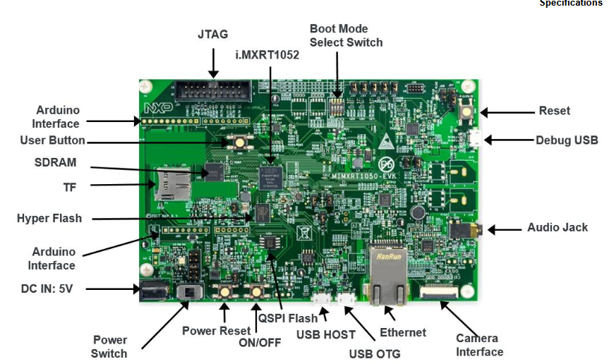

# **IMXRT1050-EVKB Evaluation Board**


## Basic Information [^1]

[^1]: click to show/hide (where supported)

> Main On-board Micro-Controller Unit (MCU) comes from  i.MX-RT1050 family:<br>
>  **MIMXRT1052**
>
> <details>
> <summary><b>Pinout</b> and <b>schema</b> of the board</summary>
>  <figcaption>Front</figcaption><br>
>  <figcaption>Back</figcaption><br>
>   <a href="pdf/imxrt1050evkb_schematic.pdf">Schematic</a>
> </details>
>
> <details>
> <summary>Further <b>documentation</b></summary>
> <ul>
> <li><a href="https://www.nxp.com/design/design-center/development-boards-and-designs/MIMXRT1050-EVK">Main Page</a>
> from , with relevant "getting started" guides and hardware references.</li>
>
> <li>Based on the <a href="https://developer.arm.com/Processors/Cortex-M7">Cortex®-M7</a> from </li>
>   <ul>
>   <li><a href="https://developer.arm.com/documentation/ddi0489/">Arm® Cortex®-M7 Processor Technical Reference Manual</a>
>    - an overview of the processor, a good starting place.
>   </li>
>   <li>
>   <a href="https://developer.arm.com/documentation/dui0646">Arm® Cortex®-M7 Devices Generic User Guide</a>
>   - a more in-depth document, useful for programming the processor.
>   </li>
>   <li>
>   <a href="https://developer.arm.com/documentation/ddi0403/latest/">ARMv7-M Architecture Reference Manual</a>
>   - very detailed, approx. 1000-page documentation for CPU etc.
>   </li>
>   <ul>
> </ul>
> </details>
>
> <!--
> <details><summary>Recommended <b>reading</b></summary>
> </details>
> -->
> 
>
## Development (means and advice/tips)

### Basic development instruments

<details><summary>
 MCUXpresso IDE</summary>

> * can be installed (Win10+, MacOS13+, Ubuntu20+) as a standalone application or used as an extension of MCUXpresso for VS Code within VSC
> * [Home Page](https://www.nxp.com/design/software/development-software/mcuxpresso-software-and-tools-/mcuxpresso-integrated-development-environment-ide:MCUXpresso-IDE)
> * Typical post-installation steps:
>   1. **Run** MCUXpresso, enter the path to your workspace; I recommend closing the Welcome tab
>      > in the *Installed SDKs* section, you can (optionally, or later edit) add SDK packages obtained e.g. from [MCUXpresso SDK Builder](https://mcuxpresso.nxp.com/en) using Drag&Drop style
>   2. **Create** a new (C/C++) project, in the wizard, gradually select the MCU (MIMXRT1050 -> MIMXRT1052xxxB), the project type and its settings
>   3. **Finish implementing** the embedded application in the *src/* subdirectory of the project
>   4. **Build** your project
>      > * e.g. by clicking the "hammer" icon in the toolbar, pressing "Build" on the Quickstart panel or using the keyboard shortcut <CTRL+B>
>      > * after successful compilation, the resulting application (firmware) will appear in the *Binaries/* section of the project in binary format
>   5. Start the **Debug** process
>      > * e.g. by pressing the appropriate "probe" icon (typ. PEmicro) on the Quickstart panel, the "bug" icon on the toolbar or by pressing the right mouse button in the Project Explorer section, then selecting "Debug As", etc.

Tips:
> * to redirect standard input/output to the MCUXpresso environment, you can use, for example, the so-called **Semihosting** (similarly, Telnet or GDB client) - see:
>   > * Quickstart panel -> Miscelaneous -> Quick Settings -> SDK Debug Console -> Semihost console
>   > * Debug Configurations -> Startup -> Enable Semihosting

</details>

<details><summary>
 Visual Studio Code (VSC)
</summary>

> 1. [Download](https://code.visualstudio.com/Download) and **install** VSC
> 2. Install in **extensions**
>    * [MCUXpresso for VS Code](https://www.nxp.com/design/design-center/software/embedded-software/mcuxpresso-for-visual-studio-code:MCUXPRESSO-VSC)
> 3. Create **new project** (or import an existing project or repository)
>    > select project type (MCUXpresso SDK or Zephyr)
> 4. **Finish implementing** the embedded application in the project (typically in C/C++)
> 5. **Build** the project
>    > the result should be a binary file (firmware) executable on the target platform
> 6. **Install** any missing **Debug Probes** (SEGGER, LinkServer, but especially **PEmicro**)
> 7. **Select** a Debug Probe supported by the board (typ. PEmicro) and **start** Debug

</details>


<details><summary>Software Development Kit (SDK) Builder</summary>

> * Configure your application-specific SDK for the appropriate platform (board, microcontroller, etc.)
>   > Import the SDK into:
>   <ul>
>   <li><a href="https://community.nxp.com/t5/MCUXpresso-IDE-Knowledge-Base/Importing-an- MCUXpresso-SDK-into-MCUXpresso-IDE/ta-p/1101175">MCUXpresso</a></li>
>   </ul>
> 
> * [Home Page](https://www.nxp.com/design/software/development-software/mcuxpresso-software-and-tools-/mcuxpresso-software-development-kit-sdk:MCUXpresso-SDK)

</details>


<details><summary>FreeMASTER</summary>

> * [Home Page](https://www.nxp.com/design/software/development-software/mcuxpresso-software-and-tools-/mcuxpresso-software-development-kit-sdk:MCUXpresso-SDK)

</details>

### General Advice/Tips

<details> <summary>Development</summary>
<ul>
<li>

> Building a new project (MCUXpresso) <br>
> > Before you build your project, make sure it is selected at the Projecte Workspace (the tab on the left side of the screen, that looks like an file manager.) 
Otherwise, you might build a different project and get unexpected results. It is also good practice to always clean the project before you do any builds, by clicking on the "broom" icon.
</li>
<li>

> Recommendations before starting a new debugging process (MCUXpresso) <br>
 > > Before starting a new Debug process, make sure that the previous debug is terminated - if you are not sure about terminating,
(the red squares for Terminate should "disappear" from the toolbars); otherwise, it may happen that pegdbserver, running as a background process, will not terminate properly and it will have to be removed before starting a new Debug process (e.g. using the Task Manager in Windows).
</li>
</ul>
</details>

<!-- 
<details>
<summary>Further (manuals, etc.)</summary>
</details>
-->

### Examples
<details>
<summary> Minimalistic Code </summary>

> ```C++
> //Sample program that prints "Hello, World!" to the serial output
>
> #include "board.h"
> #include "pin_mux.h"
> 
>
> int main(void) { 
>   
>   // Hadware Initialization
>   BOARD_ConfigMPU();
>   BOARD_InitBootPins();
>   BOARD_InitBootClocks();
>   BOARD_InitDebugConsole();
>
>   /* Just enable the trace clock, leave coresight initialization to IDE debugger */
>   SystemCoreClockUpdate();
>   CLOCK_EnableClock(kCLOCK_Trace);
>
>
>   bool running = true;
>
>   while(running){
>       PRINTF("Hello, world!"); // Macro used to print to the serial console (UART/Semihosting)"
>       running = false;
>   }
> }
> ```
</details>

<details>
<summary> LED Blink using interrupt </summary>

> There is one Led on the board that can be interfaced by the user. This program flahes it every second.

> ```C++
> /* 
> * This program uses the Systick interrupt to blink the on-board Led.
> * The interrupt can be configured to trigger repeatedly after an number of system ticks.
> */
>
> #include <stdint.h>
> #include "board.h"
> 
> //The user Led is at GPIO1, Pin 9
> #define LED0_GPIO GPIO1
> #define LED0_GPIO_PIN 9U
>
> uint32_t systick_counter = 0; // Global counter used for timing the interrupt
> bool led_state = false;  // Current Led state, False is OFF an True is ON
>
> /*
> * Function called every time the Systick interrupt is triggered
> * Decreases the global counter if it is bigger than 0
> */
>  void SysTick_Handler(void){
>   if(systick_counter > 0){
>       systick_counter--; 
>   }
>  }
>   
>  // Blocks executions for the specified number of milliseconds
>  void Systick_Delay(uint32_t time_ms) {
>   systick_counter = time_ms;
>   
>   while(systick_counter > 0){
>       // Wait for systic_counter to reach 0. 
>   } 
>  }
>
> // Toggles the current state of the Led
> void Led_Toggle(void){
>   if(led_State){
>       // Writing 1 to its GPIO pin turns it off
>       GPIO_PinWrite(LED0_GPIO, LED0_GPIO_PIN, 1U) 
>   }else{
>        GPIO_PinWrite(LED0_GPIO, LED0_GPIO_PIN, 0U)
>   }
>
>   led_state = !led_state;
>  }
>
>
> int main(void) {
>    
>   bool running = true; //Running flag
>
>   //Hardware Initialization     
>   BOARD_ConfigMPU();
>   BOARD_InitBootPins();
>   BOARD_InitBootClocks();
>   /* Update the core clock */
>   SystemCoreClockUpdate();
>   
>   //Configures the Systick interrupt to trigger every 1 ms (1000 μs)   
>   if(SysTick_Config(SystemCoreClok / 1000U)){
>       //Error Handling
>       running = false;
>   }
>   
>   while(running){
>       //Waits for a 1000 ms (1 s)
>       Systick_delay(1000);
>       Led_Toggle(); // Toggles the Led_State Every Second    
>   }
>   
>
>
>
>
> }
> ```

</details>

<details>
<summary> Interrupt triggered by pressing a button. </summary>

> The board features one push button (SW8) that can be used by the user.
> You can configure an interrupt to trigger when it is pressed.

```C++

#include "fsl_debug_console.h"
#include "fsl_gpio.h"
#include "fsl_common.h"
#include "app.h"
#include "pin_mux.h"
#include "board.h"


#define SW8_GPIO GPIO5 // GPIO 5
#define SW8_GPIO_PIN  0U // Pin 0 
#define SW8_IRQ GPIO5_Combined_0_15_IRQn // SW8 System IRQ
#define SW8_IRQHandler GPIO5_Combined_0_15_IRQHandler // System name of the function called by the IRQ

volatile bool sw_pressed = false; // Flag that carries the current state of the switch; False = Not Pressed


// Function Called by the Button interrupt
void SW8_IRQHandler(void) {
    
    GPIO_PortClearInterruptFlags(SW8_GPIO, 1U << SW8_GPIO_PIN); // Clears Interrupt status

    sw_pressed = true; // Tells the program the switch was pressed.
    SDK_ISR_EXIT_BARRIER; // DSB instruction. See https://developer.arm.com/documentation/dui0646/c/The-Cortex-M7-Instruction-Set/Miscellaneous-instructions/DSB
}

// Ad-hoc delay function. Use a big while loop or somthing like that.
void delay(void){
    //wait for a while...
}

int main(void) {

    bool running = true;

     /*
      Define the init structure for the input switch pin 
      See fsl_gpio.h for more configuration options.
     */
    gpio_pin_config_t sw_config = {
        kGPIO_DigitalInput,
        0,
        kGPIO_IntRisingEdge,
    };

    // Hadware Initialization
    BOARD_ConfigMPU();
    BOARD_InitBootPins();
    BOARD_InitBootClocks();
    BOARD_InitDebugConsole();

    EnableIRQ(SW8_IRQ); // Enables the IRQ Flag 
    GPIO_PinInit(SW8_GPIO, SW8_GPIO_PIN, &sw_config); // Initializes de GPIO and Pin using configuration defined by the user

    GPIO_PortEnableInterrupts(SW8_GPIO, 1u << SW8_GPIO_PIN); // Enables interrupts for the GPIO an Pin of SW8

    while(running){
        if(sw_pressed){
            // Software debouncing
            delay(); 

            if(GPIO_PinRead(SW8_GPIO, SW8_GPIO_PIN) == 1){
                PRINTF("SW8 is pressed."); // Macro that prints to serial output (UART/Semihosting)
            } 

            sw_pressed = false;
        }
    }

}
``` 
</details>

<details>
<summary> LED control using UART for user interface. </summary>

> Example that combines the previous two. <br>
> Creates a serial interface for the user where they can control the led manualy, or have it blink. <br>
> Blinking speed can be adjusted by pressing the user button (SW8). <br>
>
> Avaiable at [https://github.com/lucaslpmoura/imxrt1050-evkb-test-program](https://github.com/lucaslpmoura/imxrt1050-evkb-test-program)
</details>

<br>
You are also encouraged to look into the examples provided by the SDK.


